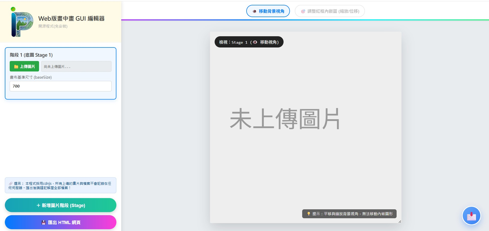
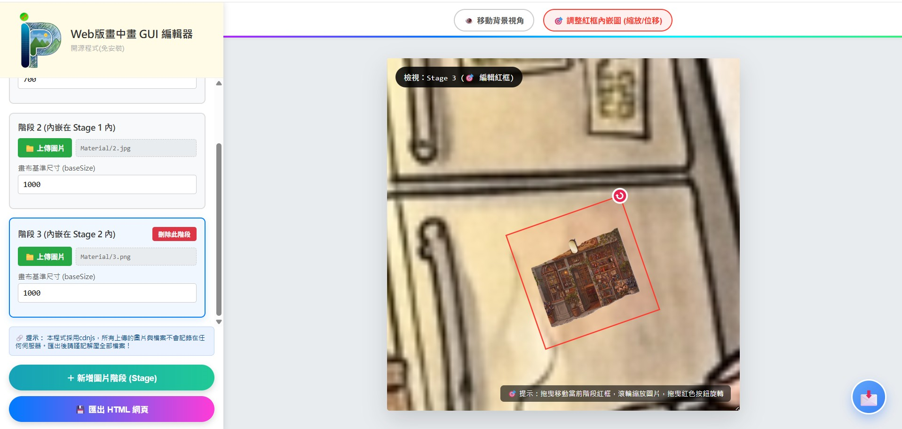

<br>

# Web-based Picture-in-Picture Editing Tool
> A lightweight, ready-to-use web tool for making Picture-in-Picture elements

## 🌟 Features
- ⚡ **Plug and Play**: Pure front-end build with zero dependencies or backend services required. Just open `index.html` and start using it.
- 💾 **Export to HTML**: Download your completed work as a standalone `.html` file for easy offline playing or sharing.
- 🔒 **Privacy-Focused**: All image processing runs locally in your browser. No data is ever uploaded to third-party servers.
- 🎨 **Clean UI**: Simple and intuitive workflow for seamless image importing and previewing.

---

## 💻 System Compatibility
>[!NOTE]
> **No GPU & No Extra Software Required**: All processing is lightweight and runs entirely inside your browser. No dedicated graphics card or additional software installation is needed.

### Supported Platforms
| Platform | Support Status |
| :--- | :---: |
| 💻 **Desktop** (macOS, Windows, Linux) | ✅ Supported |
| 📱 **Mobile & Tablet** (iOS, iPadOS, Android) | ❌ Not Supported |

### Supported Browsers
| Browser | Support Status |
| :--- | :---: |
| 🟢 **Chrome** | ✅ Supported |
| 🔵 **Edge** | ✅ Supported |
| 🦁 **Brave** | ✅ Supported |
| 🔴 **Safari** | ⚠️ Suboptimal Performance |

---


## 📌 Points to Note

* **Sharing Your Exported Project**:
  Your exported project is automatically generated as a packaged `.zip` archive. When sharing your work, **do not send just the `index.html` file alone**, as the images will fail to render without the assets. Make sure recipients extract the full `.zip` archive so that `index.html` and the `Material/` folder stay together in the same directory.

* **Directory Structure Requirements**:
  The `index.html` file must reside in the exact same directory level as the `Material/` folder:
  ```text
  📁 Project Root/
  ├── 📄 index.html         (Main Web Application File)
  └── 📁 Material/          (Image Assets Library)
      ├── 🖼️ 1.jpg
      ├── 🖼️ 2.jpg
      ├── 🖼️ 3.png
      ├── 🖼️ 4.png
      └── 🖼️ 5.png

* **Avoid Duplicate Image Names**:
Make sure no images share the exact same file name in your project. Duplicate names will clash and overwrite each other, causing the affected images to fail to render.

---

## 📸 Preview

### 💻 Main Interface
<p align="center">
  
</p>

---

### 🚀 Usage & Workflow
<p align="center">
  
</p>

---

### 🎥 Demo
<p align="center">
  
</p>

---

## 🚀 Quick Start (web version)

### Live Demo
You can give it a try online directly:  
👉 **[Click here to use my App now](https://vc-akbowie.github.io/PiP-AI-project/)**
